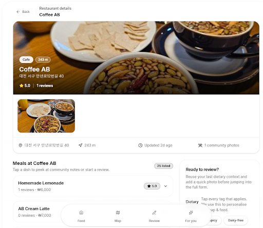
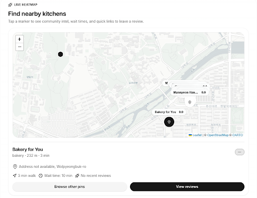
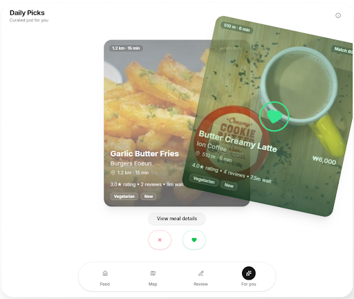

# MealMap: High Fidelity Prototype

## Project summary

International students at KAIST often struggle to discover trustworthy and diet-relevant food options nearby. Our solution, MealMap, is a social food-recommendation platform that lets users share meal reviews, explore nearby restaurants on an interactive map, and receive personalized recommendations based on past activity. Unlike generic review apps, MealMap focuses on dietary context and community-driven trust, combining personalized recommendations with culturally inclusive tagging.

## Instructions

After finishing the login, you are sent to the main page. On this page restaurants together with details such as cuisine, distance from use, rating and more can be seen, as well as the navigation bar to access the different pages and a search bar to look for specific restaurants.

The review page is accessible from the navigation bar, the review button on the home page, or from a specific meal on a restaurant’s specific page. On this page, the user can add all the details for leaving a review for a meal, including an image with the food, the price, wait time and tags. This is also the place from where users can add restaurants and meals if they do not show up when selecting from the dropdown menu.

On the restaurant page, you can see all the information about a restaurant, including the location, meals and their prices, as well as reviews for each specific meal. From this page you can also directly start reviewing for the specific restaurant, as well as for a specific meal.

The map is used to show restaurants near your location. It can be used to give a visual representation on their location compared to yours directly, as well as directly see some of the details of the restaurants closest to you.

On the “For You” page, you can easily browse through different restaurants, as well as indicate whether you like or dislike the meals shown in order to allow the web-app to give better future recommendations more catered to your specific tastes.

## URL of Prototype and GitHub Repository

The URL for our MealMap website is:
https://mealmap.christmas

The URL of our back-end GitHub repository is:
https://github.com/Brikas/mealmap

The URL of our front-end GitHub repository is:
https://github.com/DiaRar/mmap-fr

The URL of our web scraping GitHub repository is:
https://github.com/EliasDahlDTU/mealmap-webscrape.git

## Libraries and Frameworks

For the backend, we use FastAPI to compose the service into modular auth, user, place, meal and review end-point routers in a single ASGI app. We use REST principles for the endpoint architecture. SQLAlchemy with asyncpg provides non-blocking access to PostgreSQL, which lets the recommendation layer query user, review, and place data without blocking other requests. We use alembic to automatically partly generate database migrations. . Pillow is used to normalize uploaded images (EXIF fixes, resizing, JPEG output), and boto3 handles uploads to Amazon S3 and returns presigned URLs for serving images to the client. We are deploying our backend on docker containers hosted on Railway (PaaS), which provides automatic redeployment on git main branch pushes.

To keep things explainable and non-complex, we employ a heuristic instead of modern machine learning to personalize user suggestions. For now the heuristic considers the previous swipes of the user, user’s own reviews and current user location. We give the most weight to dietary preferences (tags), medium weight to place’s cuisine type and distance from the user, and lowest weights to price and waiting time preference strengths. We encode user meal preferences and meal features in matrices of values ranging from -1 to 1 for each feature and run a cosine similarity against each other to determine match strength. We also employ EMA, cold-start learning rate acceleration and epsilon-greedy exploration techniques to enhance our algorithm.

For the frontend, we build the high-fidelity prototype as a React app with TypeScript and Vite. Styling and layout are handled with Tailwind CSS plus the shadcn/ui component system, which relies on Radix UI primitives (dialogs, popovers, sliders, scroll areas, etc.), tailwind-merge, clsx, and lucide-react for icons. Client-side state is managed with Zustand, routing with react-router-dom, and server data fetching and caching with @tanstack/react-query. Forms use react-hook-form with Zod and @hookform/resolvers for schema-based validation. For micro-interactions and transitions we use motion, and sonner provides toast notifications. The codebase is tested with Vitest and Testing Library (@testing-library/react, @testing-library/user-event), and linted/typed with ESLint and TypeScript. For the rendering of the map, the Leaflet library was used, while for displaying information, the CARTO light basemap was used for the visualization with OpenStreetMap data for geographic reference.

In regards to coding support, we have mainly used Cursor for navigation/editing, ChatGPT 5.1 to brainstorm ideas and solutions, and Gemini 3 Pro to do sanity-checks and help improve code implementations once drafted.

## Individual Reflections

### Airidas Brikas (20256398)

**Which part(s) of the system did you directly contribute to?**

I primarily worked on the backend. I set up the FastAPI and PostgreSQL database and built the object models and API logic while getting feedback from my team members. This included authentication,  full CRUD endpoint logic, some image processing, small dev-ops scripts and recommendation heuristic for the swiping feature. I also set up object storage on AWS S3 and connected it to the back-end. I finally deployed the app on the cloud on Railway PaaS.

**What were some of the difficulties you faced?**

While it was not something that took most of the time, I personally faced some difficulties orienting in the Asia region as a back-end developer for the first time. I had troubles with object signing algorithms for S3 storage, which took time to debug and turned out to be due to timezone differences that I didn’t account for. I also partly regretted my choice of Railway as our cloud since the closest origin that we could pick was Singapore, which adds some unnecessary latency.

I also faced difficulties with swipe recommendation heuristic. After a conversation with Elias, we decided on a simple heuristic instead of modern machine learning for it. I didn’t want to make it so dumb, so it ended up not being that simple. I had some problems with it becoming aggressively biased towards first likes, which I solved by implementing some epsilon greedy exploration techniques - 10% chance for true random pick, + 15% change to ignore a preference group. I also had some problems when my algorithm became read-heavy due to its nature, which I predicted would increase latencies with a lot of data, so I changed the decay logic to use exponential moving average and restructured the architecture to make it more write-heavy (which I can offload as a background task) and more read-light.

**List one useful skill you learned while working on the high-fi prototype.**

A lot of my learning came from working in a team on the part that I actually did not contribute myself! I saw how Rares was making great choices with the front-end architecture, such as using React PWA app and Shad-cn design kit and strategic LLM prompting that really amazed me with the development speed compared to how I used to build front end before.

It was the first time I tried to deploy on a PaaS instead of linux VM. It took a little learning curve to understand how they function, but I was quickly rewarded with some neat control instruments. I also learned some deeper REST API standard practices and conventions, which I learned is important since it makes aligning with the team easier. Finally, it was the first time I tried to do a recommender algorithm. My initial design changed so much compared to what I ended up doing, so I could say I learned quite a bit and also understood how much more there is to learn.

### George-Matei Andrei (20256394)

**Which part(s) of the system did you directly contribute to?**

I worked on the front-end of the app, specifically on getting the map page integrated and making it functional. This included finding libraries that best supported map creation in React, finding a base tile that fit the light theme of the app, as well as adding different logic improvements to better the user experience. These logic improvements include having the map zoom and center be always properly set, shrinking and having the icons disappear when the map becomes more zoomed out, as well as fetching the user’s location in a safe way to both display on the map and roughly calculate travel time.

**What were some of the difficulties you faced?**

The main difficulty I faced had to do with keeping up with changes done in two separate repositories at the same time, since prior to this I had only worked with centralized repositories. This led to me having to keep track of key points that were more spread out, including changes made to logic or code additions that changed how the project was functioning. For example, this led to me not properly understanding how some of the API endpoints worked leading to the map presenting real data only very close to the project deadline.

Another aspect that posed some difficulty was getting used to including Tailwind for styling as prior to this I had only used plain CSS in projects. This not only was a problem from the aspect of having to learn how to properly write the styling I wanted using Tailwind, but the clutter caused it proved to affect me more than expected since I had a rougher time reading and going through the code that was already written to understand what it did.

**List one useful skill you learned while working on the high-fi prototype.**

The most useful skill I have learnt was getting used to using Tailwind and having it be part of the code itself, since it offers much faster and easier to predict styling options than base CSS, which was something I had trouble with before. Besides this I was also introduced to many different ways of designing and implementing features, both on the front and back-end, with some styling libraries and hook implementations being used on the front-end that I had not seen before, as well as ways of populating databases that I had not thought of before.

### Rares A. C. Diaconescu (20256417)

**Which part(s) of the system did you directly contribute to?**

I was responsible for the architectural design and implementation of the frontend application using React, TypeScript, and Vite. My work covered the entire application lifecycle—from setting up the routing and authentication flows (login/register) to building the core feature sets: the Dashboard, Feed, Recommendations (swiping interface), Restaurant/Meal details, and the multi-step Review Submission process. I integrated these components with the backend API using TanStack Query for efficient data fetching and caching, ensuring a responsive user experience. I also handled global state management using Zustand. The major feature I did not implement was map visualization.

**What were some of the difficulties you faced?**

One significant challenge was designing a seamless and intuitive user experience for the complex review submission flow. It required handling multi-step forms, image uploads, tagging systems, and dynamic validation while keeping the UI responsive. Additionally, integrating with a backend that was being developed in parallel required constant communication to align on API contracts and data types. Managing the asynchronous nature of these interactions—handling loading states, optimistic updates, and error boundaries—was crucial to prevent the app from feeling 'broken' during network latency.

**List one useful skill you learned while working on the high-fi prototype.**

I significantly deepened my expertise in modern React patterns, particularly the separation of server state (managed via TanStack Query) and client state (managed via Zustand). This distinction allowed me to build a highly performant application with minimal unnecessary re-renders. I also honed my skills in using 'headless' UI libraries like Radix UI (via shadcn/ui) combined with Tailwind CSS to rapidly build accessible, high-quality components without getting bogged down in CSS maintenance.

### Elias Lunøe (20256395)

**Which part(s) of the system did you directly contribute to?**

I webscraped about 900 real restaurants and 8,000 real meals from KakaoMap, handling their API quirks, parsing place metadata, and extracting meal names and prices. Then I generated 100 fake personas with distinct personality types; everything from “Gen Z Bro” and “Fine Lady” to “Kawaii UwU.” Each persona gets one or two traits (most get a mix of two, with an 80% chance), which makes their writing style and rating behavior more realistic and distinct (and even hilarious at times). Using these personas, I created ~900 fake reviews with GPT-4o-mini, generating personality-aligned text, star ratings, and custom meal tags. I also integrated Google Images to fetch meal photos, though this turned out to be trickier than expected because many meal names are super ambiguous without extra context.

**What were some of the difficulties you faced?**

A lot. The Railway API kept throwing 422 errors because some endpoints expected JSON while others required form data, and “\auth\register” only accepts email and password, so updating names had to be done in a separate call. Kakao and Google Image fetches often returned HTML redirect pages instead of actual images, so I had to spoof a browser-like User-Agent and detect file types via magic bytes to avoid corrupt downloads. Ambiguous meal names like “5 people”, “high quality large”, and “black hole” completely confused the image API because I forgot to add context to the search - a borderline catastrophic but funny slip-up which I’m still fixing. I had to implement custom rate limiters for every external service, and coordinating those in async code (without race conditions) was harder than expected. Getting GPT to blend two personalities 50/50 and stay within a 50–120 word limit took a lot of prompt engineering. PIL also refuses to handle some WebP formats unless you set the right headers, so I had to patch that too. And finally, adding crash-safe progress tracking so scripts resume without duplicates was surprisingly tedious but worth it.

**List one useful skill you learned while working on the high-fi prototype.**

I learned async programming with Python's `asyncio` and `httpx`. Before this project, I'd only done basic synchronous API calls. Learning to properly use `async/await`, `asyncio.gather()`, and async HTTP clients made the scripts significantly faster by handling multiple API calls concurrently instead of waiting for each one sequentially. I also learned about rate limiting in async contexts, which requires locks to prevent race conditions when multiple coroutines are trying to check and update timing information simultaneously. This skill is super useful for any backend work where I'm making lots of API calls.
